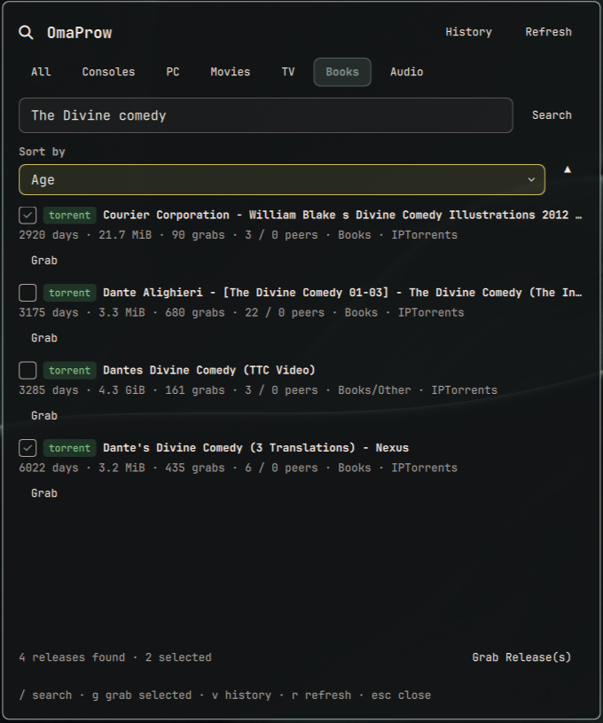

# OmaProw

An [Omarchy](https://omarchy.org/) bar widget for [Prowlarr](https://prowlarr.com/), the indexer manager. Search across every indexer Prowlarr manages, sort and filter the results, and grab releases — individually or in bulk — without leaving the desktop.



## Features

- **Search** — query Prowlarr across all your indexers, filtered by category: All, Consoles, PC, Movies, TV, Books, Audio
- **Sortable results** — Age, Title, Size, Grabs, Peers, Category or Indexer, ascending or descending
- **Grab** — one click on a release, or select several with the checkbox and use "Grab Release(s)" for a bulk grab. Grabbing pushes the release straight to whatever download client(s) you already have configured in Prowlarr — exactly what Prowlarr's own "Grab Release(s)" button does
- **History** — Prowlarr's own event history (searches, RSS, grabs) for this instance, paginated
- **Keyboard-driven**: `/` focuses search, `g` grabs the current selection, `v` switches between Search and History, `r` refreshes, `esc` returns focus from the search field or closes the panel

## Requirements

- A running [Prowlarr](https://prowlarr.com/) instance
- A Prowlarr API key (Settings → General → Security in the Prowlarr web UI)

## Install

```bash
omarchy plugin add https://github.com/marcuspelo/omaprow.git
```

## Setup

1. Create `~/.config/omaprow/.env` with your Prowlarr API key:
   ```
   API_KEY=your-prowlarr-api-key
   URL_BASE=http://your-prowlarr-host:9696
   ```
   Keeping the key in this file (outside the plugin folder) instead of `shell.json` keeps it out of any config you might sync or share. `URL_BASE` is optional but recommended: `omarchy plugin disable`/`enable` drops the widget's bar-layout entry (including whatever `baseUrl` was set via the panel or `omarchy bar set`), so a value in `.env` is what keeps working across that reset.
2. Enable the widget:
   ```bash
   omarchy plugin enable marcuspelo.omaprow
   ```
   Setting `baseUrl` via `omarchy bar set marcuspelo.omaprow baseUrl "http://your-prowlarr-host:9696"` is only needed if `URL_BASE` isn't set in `.env`.

## Security

The API key never appears in process arguments: every `curl` call sends it as an `X-Api-Key` header supplied over the child process's stdin (`curl -K -` with a `header = "X-Api-Key: ..."` config line), not as a `-H` argument — so it's invisible to `ps`/process inspection. `~/.config/omaprow/.env` is also set to mode `0600` automatically every time the plugin reads it; you can do this yourself too: `chmod 600 ~/.config/omaprow/.env`.

Note: Prowlarr's search results embed the API key directly in each release's `downloadUrl` field. This plugin never uses `downloadUrl` — grabbing goes through Prowlarr's own `POST /api/v1/search` grab endpoint instead, addressed by release + indexer id, so the key stays out of that path too.

## Configuration

Available settings (`shell.json`, or `omarchy bar set marcuspelo.omaprow <key> <value>`):

| Setting | Type | Default | Description |
|---|---|---|---|
| `baseUrl` | string | (empty) | Base URL of your Prowlarr instance (no trailing slash). Falls back to `URL_BASE` in `~/.config/omaprow/.env` when unset. |
| `pageSize` | integer | `100` | Maximum releases requested per search (10–500) |
| `defaultCategoryId` | integer | `0` | Category pre-selected on open (`0` All, `1000` Consoles, `2000` Movies, `3000` Audio, `4000` PC, `5000` TV, `7000` Books) |

## Keyboard shortcuts

| Key | Action |
|---|---|
| `/` | Focus the search field |
| `enter` (in search field) | Run the search |
| `g` | Grab every selected release |
| `v` | Switch between Search and History |
| `r` | Refresh (re-run the search, or reload history) |
| `esc` | Drop focus from the search field back to shortcuts; closes the panel otherwise |

## Remove

```bash
omarchy plugin remove marcuspelo.omaprow
```

## License

MIT
